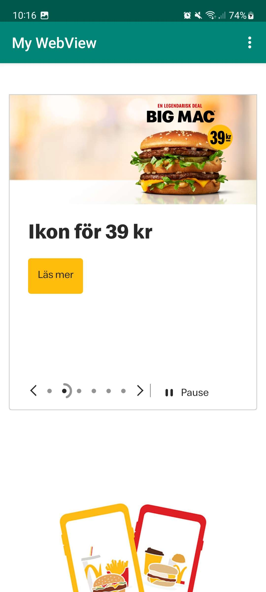

# Rapport

## Följande grundsyn gäller dugga-svar:

Jag har lagt till en webView och aktiverat den via webViewClient.
Jag aktiverade sedan även JavaScript för att kunna lägga in mina
två olika URLs som är Guthib och McDonalds.

```
private WebView myWebView;
private WebViewClient myWebViewClient;
private WebSettings myWebSetting;

myWebView = findViewById(R.id.my_webView);
myWebView.setWebViewClient(myWebViewClient);

myWebSetting = myWebView.getSettings();
myWebSetting.setJavaScriptEnabled(true);
```


